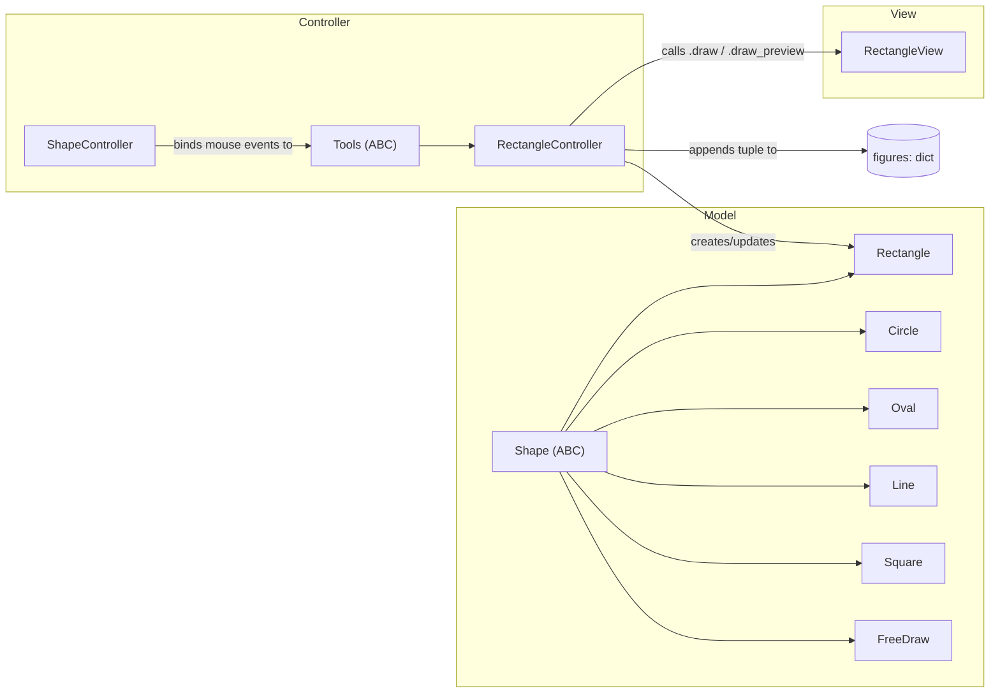

# ProDraw — Architecture Guide

This document explains **how** ProDraw is built, not just what it does. It's
aimed at a developer who has read the [`README.md`](./README.md), has the
app running locally, and now wants to make a change without breaking the
design the original authors put in place.

## Table of contents

1. [The three layers](#the-three-layers)
2. [The composition root](#the-composition-root-workspacepy)
3. [Shared mutable state: `figures`](#shared-mutable-state-figures)
4. [SOLID in practice](#solid-in-practice)
5. [Adding a new shape tool](#adding-a-new-shape-tool)
6. [Adding a new workspace panel](#adding-a-new-workspace-panel)
7. [Known limitations & suggested next steps](#known-limitations--suggested-next-steps)

## The three layers

Every package under `src/prodraw/` is split into `models/`, `views/`, and
`controllers/`, and each of those is further split into `shapes/`, `window/`,
and `workspace/`. The rule that keeps this consistent is simple:

| Layer | Lives in | Allowed to import `tkinter`? | Responsibility |
|---|---|---|---|
| **Model** | `models/` | Only for `StringVar`-style state holders, never widgets | Pure data + validation. No drawing, no event handling. |
| **View** | `views/` | Yes — that's its only job | Draw primitives onto the `Canvas` from data it's given. No decisions. |
| **Controller** | `controllers/` | Yes | The *only* layer allowed to know about both raw Tkinter events and model state. Bridges the two. |

`Rectangle` is a good example of the pattern end to end:

- **Model** — `models/shapes/rectangle.py` defines `Rectangle`, a
  `@dataclass` that knows how to track its own start/end coordinates and
  decide `has_min_size()`. It has no idea a `Canvas` exists.
- **View** — `views/shapes/rectangle_view.py` defines `RectangleView`, which
  only knows how to call `canvas.create_rectangle(...)` from coordinates and
  a color it's handed. It never decides *when* to draw.
- **Controller** — `controllers/shapes/rectangle/rectangle_controller.py`
  defines `RectangleController(Tools)`, which binds `<ButtonPress-1>`,
  `<B1-Motion>`, and `<ButtonRelease-1>`, creates a `Rectangle` on press,
  updates it on drag, asks the view to render a live preview, and — on
  release — commits the shape into the shared `figures` dict and asks the
  view to draw the final version.



Every other shape (`Circle`, `Oval`, `Line`, `Square`, `FreeDraw`) repeats
this exact three-file shape, and every self-contained workspace panel
(color picker, tool options, actions panel, zoom, grid, toolbar, menubar)
repeats the same model/view/controller trio at a smaller scale.

## The composition root: `workspace.py`

`src/prodraw/workspace.py` is where everything gets wired together — it's
the closest thing this project has to a dependency-injection container.
`Workspace.start()`:

1. Instantiates every workspace controller (`ColorPickerController`,
   `GridsController`, `ToolOptionsController`, `ActionsPanelController`,
   `ToolsController`, `ZoomController`, ...).
2. Calls each controller's `setup()`.
3. **Cross-references** controllers that need to call into each other after
   construction — e.g. `actions_panel_ctrl.cursor = toolsbar.cursor` lets
   the *Delete*/*Duplicate*/*Layer* buttons in the action panel delegate
   directly to `CursorController`, and
   `tool_options_ctrl.on_option_change_callback = toolsbar.cursor.update_shape_style`
   lets a fill/border change in the Tool Options panel immediately restyle
   whatever shape is currently selected.

This manual wiring step is the trickiest part of the codebase for a
newcomer — there's no framework doing it for you, so if you add a controller
that needs to talk to another one, you wire it here, following the existing
`# CROSS-REFERENCES` comments as a template.

## Shared mutable state: `figures`

There is exactly one canonical list of what's on the canvas:

```python
self.figures = {
    'Circle': [], 'Rectangle': [],
    'Oval': [], 'Line': [], 'FreeDraw': [], 'Square': []
}
```

This dict is created once in `Workspace.__init__` and passed **by
reference** into every shape controller and into `CursorController`. Each
committed shape is stored as a plain tuple (e.g.
`(shape_id, start_x, start_y, end_x, end_y, distance_x, distance_y, bg)` for
a `Rectangle`) except `FreeDraw`, which is stored as a `dict` because it also
needs to hold a variable-length list of stroke `positions`.

Two consequences worth knowing before you touch this:

- **Tuples are positional.** If you add a field to a shape's `to_tuple()`,
  every piece of code that unpacks that tuple (`_move_figure`,
  `change_shape_color`, `paste_shapes`, the shape's own `*_sync_data`
  function) needs to be updated in lockstep, or indices will silently shift.
- **There is no undo history.** `figures` only ever holds the *current*
  state — see [Known limitations](#known-limitations--suggested-next-steps).

Saving/loading (`Workspace.save_file` / `load_file`) simply `pickle.dump`s
and `pickle.load`s this dict to/from a `.prodraw` file, then replays each
shape through its `*_sync_data` function (e.g. `rectangle_sync_data`) to
redraw it on the canvas.

## SOLID in practice

The course requirement to apply SOLID isn't just a comment in the README —
you can point at the specific classes that implement each principle:

- **Single Responsibility** — a view *only* draws
  (`RectangleView.draw`/`draw_preview`/`clear_preview`/`delete`), a model
  *only* tracks shape state (`Rectangle.start`/`update`/`has_min_size`), and
  a controller is the only place mouse events and business rules mix. No
  class does more than one of these three jobs.

- **Open/Closed** — `Shape` (`models/shapes/shape.py`) and `Tools`
  (`controllers/shapes/tools.py`) are `ABC`s that define a fixed contract
  (`start`/`update`/`has_min_size`/`to_tuple` and
  `_on_press`/`_on_drag`/`_on_release`, respectively). Adding a new shape
  means writing a new subclass and registering it — `ShapeController` and
  `ToolsController._on_select` never need to change.

- **Liskov Substitution** — `ShapeController` is instantiated identically
  for every tool (`ShapeController(bind_fn, view_fn)` in
  `ToolsController._on_select`), regardless of whether `bind_fn` is a
  `RectangleController`, `CircleController`, or `FreeDrawController`. Any
  `Tools` subclass can stand in for any other without `ShapeController`
  knowing the difference.

- **Interface Segregation** — `Tools` and `Shape` each expose only the
  handful of methods every implementation actually needs. There's no
  fat base class forcing e.g. `Line` to implement a `radius` concept it
  doesn't have.

- **Dependency Inversion** — `ShapeController` and `ToolsController` depend
  on the abstract `Tools` type (and on the `DRAW_TOOLS` / `BUTTON_CLASSES`
  lookup tables), never on a concrete shape controller class directly. The
  concrete wiring only happens at the edges (`models/workspace/tools_model.py`
  and `controllers/workspace/tools_controller.py`).

## Adding a new shape tool

Say you want to add a `Triangle` tool. Follow the exact pattern `Square`
already uses — these are the files you'll touch:

1. **Model** — create `models/shapes/triangle.py`:
   ```python
   @dataclass
   class Triangle(Shape):
       ...
       def start(self, x, y): ...
       def update(self, x, y): ...
       def has_min_size(self) -> bool: ...
       def to_tuple(self): ...
   ```
   Export it from `models/shapes/__init__.py` and `models/__init__.py`.

2. **View** — create `views/shapes/triangle_view.py` with `draw`,
   `draw_preview`, `clear_preview`, and `delete`, following
   `rectangle_view.py`. Export it from `views/shapes/__init__.py` and
   `views/__init__.py`.

3. **Controller** — create `controllers/shapes/triangle/triangle_controller.py`
   with `TriangleController(Tools)` implementing `_on_press`, `_on_drag`,
   `_on_release`, plus `controllers/shapes/triangle/use_triangle.py` with
   `triangle_bind`, `triangle_sync_data`, and `triangle_delete` functions
   (mirrors `use_rectangle.py`). Export the sync/delete functions from
   `controllers/shapes/__init__.py`.

4. **Register the tool** in `models/workspace/tools_model.py`:
   ```python
   DRAW_TOOLS = {
       ...,
       'triangle': (TriangleController(), TriangleView()),
   }
   ```

5. **Add a toolbar button model** — create
   `models/workspace/buttons_model/triangle.py`, a `Button` subclass that
   implements `draw()` to render the icon (mirrors
   `buttons_model/rectangle.py`), then register it in
   `controllers/workspace/tools_controller.py`'s `BUTTON_CLASSES` dict.

6. **Register storage** — add `'Triangle': []` to the `self.figures` dict in
   `workspace.py`, and add a `'Triangle'` branch to `Workspace.load_file`
   (calling `triangle_sync_data`) and to `DrawsModel.SHAPE_TAGS` in
   `models/workspace/draws_model.py` so *Clear workspace* also removes
   triangles.

That's it — you never need to touch `ShapeController`, `ToolsController`
dispatch logic, or `CursorController`'s selection/move code beyond adding a
branch for the new tuple shape (in `_get_selected_figures` and
`_move_figure`), which is the one place shape-specific tuple layouts still
leak into shared code.

## Adding a new workspace panel

Panels like the color picker or the tool options follow the same
model/view/controller trio, but at the `workspace/` level instead of
`shapes/`. To add a new panel:

1. Create `models/workspace/<panel>_model.py` holding its state/config.
2. Create `views/workspace/<panel>_view.py` that builds its Tkinter widgets
   from the model and exposes `build()`/`highlight()`-style methods — no
   business logic.
3. Create `controllers/workspace/<panel>_controller.py` with a `setup()`
   method and any click handlers.
4. Instantiate and `setup()` it inside `Workspace.start()`, and add any
   `# CROSS-REFERENCES` wiring it needs (e.g. give it access to
   `toolsbar.cursor` if it needs to act on the current selection).

## Known limitations & suggested next steps

- **Undo/Redo are stubbed out.** `ActionsPanelController._trigger_undo` and
  `_trigger_redo` currently just `print()` a message — the buttons exist and
  are correctly enabled/disabled, but there's no command history to replay.
  Implementing this would mean introducing a command/memento pattern that
  snapshots `figures` (or individual mutations to it) before each
  destructive operation (`delete_selected_figures`, `_move_figure`,
  `clear_all_figures`, shape creation), and a `UndoController` (or an
  extension of `ActionsPanelController`) that pops from that history.
- **`figures` tuples grow brittle as more code reads their positional
  layout.** A worthwhile refactor is migrating every shape's storage to a
  small `dict`/`dataclass`-based representation (the way `FreeDraw` already
  works) so fields are accessed by name instead of index everywhere
  (`_move_figure`, `change_shape_color`, `paste_shapes`, etc.).
- **No automated tests.** The `Shape` subclasses are pure logic with zero
  Tkinter dependency, which makes them the easiest, highest-value place to
  start writing unit tests.
- **No CI / linting.** Consider adding a GitHub Actions workflow that runs
  `ruff`/`black`/`pytest` on every pull request once tests exist.
